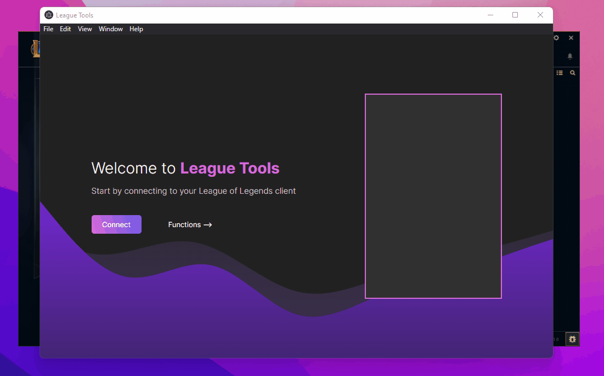

# League Tools


A cross-platform desktop app with many League Client exploits:

- Change your profile icon to any icon
- Change your profile background to any splashart
- Bypass status character limit
- Change your availability (for example appear as offline)
- Clear selected challenge tokens
- Use the same challenge token multiple times
- Display custom ranks in all ranked game modes & challenges

## 🧩 Demo



## 💾 Installation

Either download and install the latest release or make your own changes to this project by cloning this repository.

### Download

- [Windows](https://github.com/7rebux/league-tools/releases/download/0.6.0/league-tools-0.6.0-win32-x64.zip)
- Linux (Coming soon)

### Development

#### App

```bash
git clone "https://github.com/7rebux/league-tools"
npm i -G pnpm
cd "./league-tools"
pnpm i
pnpm start
```

#### Component Library

```bash
cd "./component-lib"
pnpm i
pnpm start # This will start a local storybook instance
```

Make sure to run `pnpm build` after you made changes, to update the library for the app project.

## 👨‍💻 Contributing

Just open a pull request and explain your additions and changes.

## ℹ️ Riot Games

This project isn’t endorsed by Riot Games and doesn’t reflect the views or opinions of Riot Games or anyone officially involved in producing or managing League of Legends. League of Legends and Riot Games are trademarks or registered trademarks of Riot Games, Inc. League of Legends © Riot Games, Inc.

## ⚖️ License

This project is licensed under the MIT License - see the [LICENSE file](/LICENSE) for details

## 🔗 Related Projects

[Awesome League](https://github.com/CommunityDragon/awesome-league), a list of things that work with the League of Legends API.
